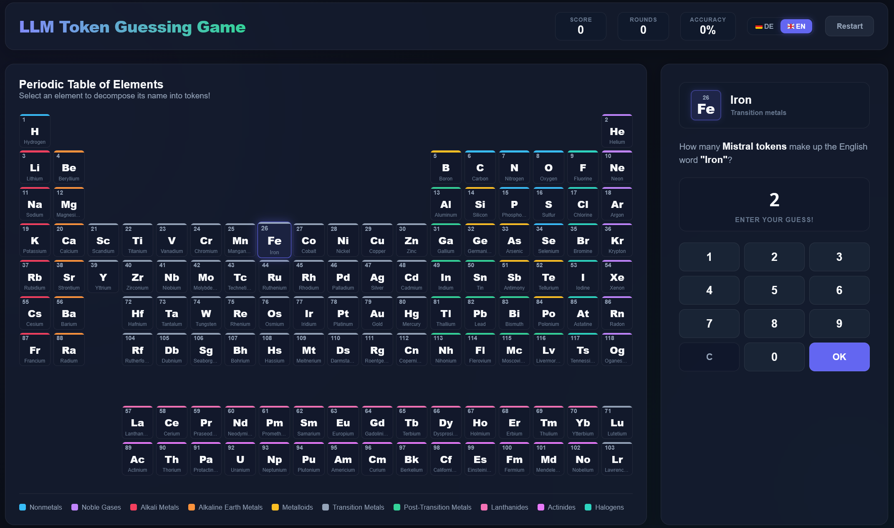

# LLM Token Guessing Game

An interactive browser game for guessing LLM token counts (Mistral-7B tokenizer) for chemical elements in the periodic table.

Ein interaktives Browser-Spiel zum Erraten Token-Anzahl im Mistral-7B Tokenizer für chemische Elemente im Periodensystem.

## Usage / Verwendung

Simply open `index.html` in any modern web browser. No web server or external dependencies are required. Try it online at [https://adrian-ehrenhofer.github.io/ElementTokenGuesser/](https://adrian-ehrenhofer.github.io/ElementTokenGuesser/)!

Öffne einfach `index.html` in einem beliebigen Webbrowser. Es werden keine Server oder externen Abhängigkeiten benötigt. Probiere es jetzt online aus unter [https://adrian-ehrenhofer.github.io/ElementTokenGuesser/](https://adrian-ehrenhofer.github.io/ElementTokenGuesser/)!

## Features / Funktionen

- Interactive Periodic Table of Elements / Interaktives Periodensystem der Elemente
- Bilingual (German / English) / Zweisprachig (Deutsch / Englisch)
- Runs locally and offline / Läuft vollständig lokal und offline im Browser

## License / Lizenz

This project was developed by Adrian Ehrenhofer for educational purposes and licensed under the [MIT License](LICENSE.md).
